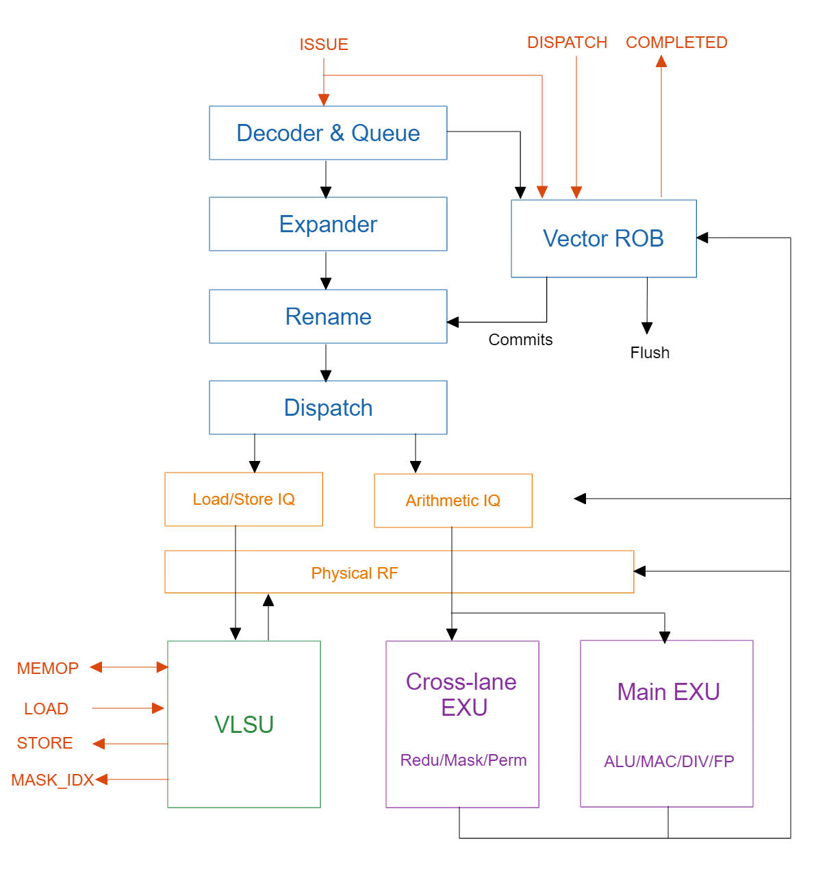

# riscv-vector
Vector Acceleration IP core for RISC-V*.  
## Introduction
Vector Acceleration IP core for RISC-V* is a flexible RISC-V Vector unit that aims to support RISC-V Vector extension. The interface is based on OVI (Open Vector Interface) in order to integrate with different scalar cores. The code is written with Chisel. 
## Status
So far, the arithmetic functional units are sufficiently tested. Other functions such as load/store and control flow only passed basic test.

> Arithmetic FUs are located at *src/main/scala/darecreek/exu/vfucore/*, which contains 64-bit FU cores (mask and permutation are VLEN-bit). You can write a wrapper to compose multiple 64-bit FUs into one VLEN-bit FU. In this project, the *exu/lanevfu* and *exu/crosslane* are FU wrappers (with VLEN=256).

**Note**: this project is suspended now.

## Architecture
As shown below, it is an out-of-order vector core with OVI interface (orange arrows). There are one arithmetic issue queue and one load/store issue queue, which can operate simultaneously. Each issue queue issues micro-ops in order, but it can be modified to out-of-order issuing potentially. 

Please refer to [Design Introduction](./doc/design.md) for more details.

## License
Only the OVI(Open Vector Interface) is under Solderpad Hardware License v2.1 and others follow the Mulan PSL v2.  
    
