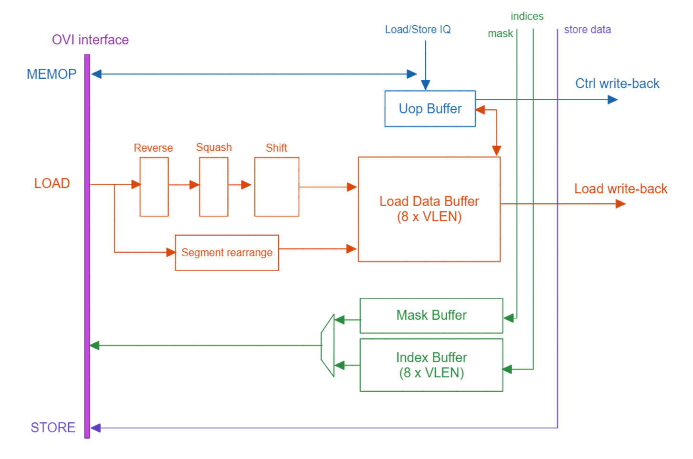

# Design Introduction

## Decoder
The decoder decodes instructions from scalar core into micro-ops. These output micro-ops are fed into vector queue, vector ROB, info calculator, and illegal instruction detector.
The info calculator (VInfoCalc) calculates some extra information from micro-op.
The illegal instruction detector (VIllegalInstrn) receives outputs of decoder and info calculator.

## Vector Queue
Vector queue buffers micro-ops from decoder. The sizes of vector queue and vector ROB are identical (16). The scalar source operands are also buffered in vector queue for future use.

## Parallel Expander
The output of vector queue goes to the expander which expands micro-op into multiple expanded micro-ops. For example, a micro-op of vector-add with LMUL=8 is expanded into 8 expanded micro-ops.
The expander supports parallel inputs and outputs. Below are examples of parallelism equals to 2.

(1) Example of one vadd (lmul=4) and one vsub (lmul=4) instruction:
|          | clock1 | clock2 | clock3 | clock4 | clock5 |
| --- | --- | --- | --- | --- | --- |
| Input0 |  vadd |  |  |  |  |
| Input1 |  vsub |  |  |  |  |
| Output0 | | vadd_expd0 | vadd_expd2 | vsub_expd0 | vsub_expd2 |
| Output1 | | vadd_expd1 | vadd_expd3 | vsub_expd1 | vsub_expd3 |

(2) Example of one vadd (lmul=1) and one vsub (lmul=2) instruction:
|          | clock1 | clock2 | clock3 |
| --- | --- | --- | --- |
| Input0 | vadd |  |  |
| Input1 | vsub |  |  |
| Output0 |  | vadd_expd0 | vsub_expd1 |
| Output1 |  | vsub_expd0 | n/a |

## Renaming
A parallel rename unit maps logic vector registers into physical vector registers.
There is a commit (architectural) rename table aiming to recover RAT (Rename Table) when pipeline is being flushed.

## Vector ROB
The ROB (Reorder Buffer) records micro-ops from decoder. It receives writeback signals from EXU and LSU and update related fields. An in-order commit scheme is applied.
There is a rename history buffer that records renaming information and provides necessary data to committing instruction which performs physical register release to the free list which locates in the rename unit.
The committing duration of one instruction may last more than one clock cycles since it may contain multiple expanded micro-ops.

## Issue Queue
So far, the issue queue performs in-order issuing. There are one arithmetic issue queue and one load/store issue queue. Each issue queue receives back pressure (ready) signal from corresponding execution (or load/store) unit.

## Lane EXU
Lane EXU (darecreek/exu/lanevfu/laneExu.scala) performs execution of ALU, multiplication, most floating-point operations, etc.
Lane EXU is composed of multiple 64-bit lanes. Our design uses VLEN = 256, so there are four lanes in the lane EXU.

## Cross-lane EXU
Cross-lane EXU (darecreek/exu/crosslane/CrossLaneExu.scala) performs execution of permutation, reduction, mask, and division instructions.

## Old Vd reading
One disadvantage of renaming in RVV is that sometimes the old Vd (destination register value) should be read from the RF as one source operand. This is because the mask-undisturbed and tail-undisturbed need to keep the old value of the corresponding elements in the destination register. 

## Vector LSU
Vector LSU transforms load/store requests into OVI interface format and resolve load responses from OVI interface. The blocks labeled Reverse, Squash, and Shift in the diagram below are dedicated to handling the OVI load response format.
 

## Where the vector LSU can be improved?
1. Change the width of load response data from fixed 512 to VLEN. This can reduce the area of load data buffer.
2. Load request should be sent as early as possible. Current implementation send the load request at issue queue stage. Sending it at earlier stage if possible would potentially improve the IPC.
3. So far, the old Vd (destination register value) is read at the same time of load-request sending and temporarily put in the load data buffer. It will be better to postpone the old Vd reading to the load-writeback stage, which will reduce the buffer area.
